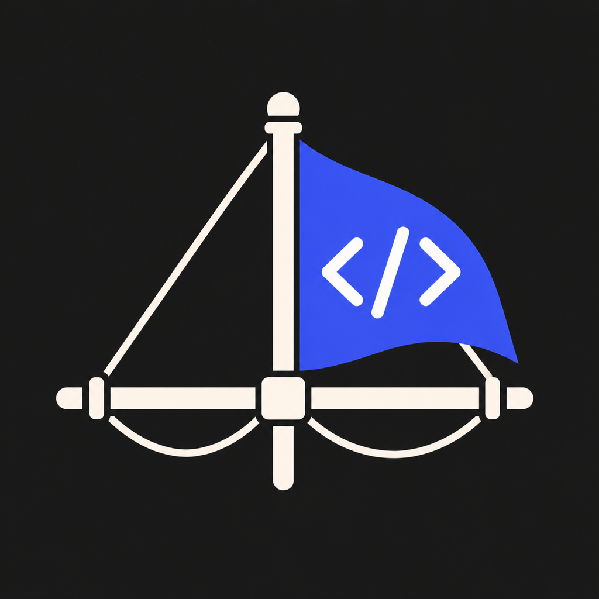

<p align="center">
  
</p>

<h1 align="center">Yardarm</h1>

<p align="center">
  A standalone desktop app for <a href="https://code.mastra.ai">Mastra Code</a>.
</p>

Yardarm is an Electron UI for the Mastra Code coding agent. The `mastracode`
runtime is bundled with the app — no separate install and no account required
to launch. It shares every config file with the `mastracode` CLI, so you can
move between the app and the terminal freely, and a global CLI install is one
click away (Settings → About).

> Yardarm is an independent project that builds on Mastra Code. It is not
> affiliated with, endorsed by, or sponsored by Mastra.

## Contents

- [Why Mastra Code](#why-mastra-code)
- [What Yardarm adds](#what-yardarm-adds-over-the-cli)
- [Features](#features)
- [Install](#install)
- [First run](#first-run)
- [Using the app](#using-the-app)
- [Configuration paths](#configuration-paths-shared-with-the-mastracode-cli)
- [App data](#app-data)
- [FAQ](#faq)
- [Troubleshooting](#troubleshooting)
- [Development](#development)
- [Contributing](#contributing)
- [License](#license)

## Why Mastra Code

Yardarm exists because Mastra Code is a genuinely different coding agent:

- **Observational Memory** — instead of compacting the conversation when
  context runs out, a background observer continuously distills what matters
  and a reflector condenses it further. The agent keeps working with a small,
  dense memory of the session, so long-running work doesn't fall off a cliff
  at the context limit.
- **Goals with a judge** — hand the agent an objective (`/goal`) and it keeps
  running until an independent judge model agrees the goal is met, not just
  until the first "done" claim.
- **Bring any model** — OAuth in with existing Claude, OpenAI Codex, or
  GitHub Copilot subscriptions, use API keys from a dozen providers, or point
  it at any OpenAI-compatible endpoint (Ollama, LM Studio, vLLM, …).
  Different models per mode, per subagent, per judge, and per memory role.
- **Deeply extensible** — MCP servers, lifecycle hooks, skills and plugins,
  subagents, and custom slash commands (plain `.md` files), all configurable
  globally or per project.
- **Open source and local-first** — configuration is plain files on disk,
  shared between the CLI, ACP editors, and this app.

## What Yardarm adds over the CLI

Everything Mastra Code can do, the CLI can do — Yardarm is about what happens
around the agent:

- **Parallel agents on one repo** — the CLI works in your checkout; Yardarm
  gives every chat its own git worktree on a `yardarm/…` branch, so several
  agents can build, test, and commit on the same project at once without
  touching your working copy or each other.
- **One-click rollback of code + conversation** — every user message pins a
  checkpoint (a real git ref). Roll back and both the transcript and the
  working tree return to that moment, with the agent told what happened.
- **Review and ship without leaving the app** — side-by-side Monaco diffs of
  exactly what the agent changed, staging, commit, and push (with `gh` for PR
  flows), plus a real terminal and file viewer scoped to the chat's worktree.
- **Persistent, organized history** — projects and chats with full
  transcripts survive restarts in a local SQLite database, independent of any
  terminal session or scrollback.
- **Everything visible at a glance** — tool calls as expandable cards,
  plan-approval and tool-approval prompts as buttons, a live goal banner, and
  Observational Memory activity/token budgets as status UI instead of
  terminal output that scrolls away.
- **Configuration without hand-editing JSON** — dialogs for API keys and
  OAuth, per-mode/subagent/judge/memory models, custom providers, MCP
  servers, hooks, permissions, and per-project settings — all written back
  to the same files the CLI reads.
- **Local models that just work** — Ollama auto-detect and auto-start,
  dropdowns filtered to models that will actually run, and no idle timeouts
  so a big local model can think for minutes without the run being cut off.
- **A gentler on-ramp** — a first-run wizard mirroring CLI onboarding, and a
  one-click global CLI install from Settings → About when you want the
  terminal too.

## Features

**Agent chat**

- Streaming agent chat with tool-call cards, plan approval, and tool-approval
  prompts (allow once / always / deny)
- Plan / Build / Fast modes, per-mode model selection, extended-thinking
  toggle, and yolo mode
- Session permissions panel (`/permissions`): per-category and per-tool
  allow / ask / deny
- Goals (`/goal`) with a live goal banner, and Observational Memory status
  (`/om`) showing observer/reflector activity and token budgets
- Threads (`/threads`): switch, rename, clone, delete, open in a new subchat,
  with per-thread token usage in the cost popover (`/cost`)
- Multiple subchats per chat, each with its own agent process

**Slash commands**

- Autocomplete for the full command surface from code.mastra.ai — mode and
  model switches, threads, `/mcp`, `/hooks`, `/commands`, `/skills`,
  `/resource`, `/login`, `/api-keys`, `/diff`, `/help`, and more
- Project and global custom commands (`.md` files with frontmatter) are
  loaded through the mastracode command loader and run as prompts
- Commands that only make sense in a terminal (e.g. `/sandbox`, `/voice`)
  are listed in `/help` and point you to the CLI

**Local and custom models**

- Ollama is auto-detected (and can be auto-started); any OpenAI-compatible
  server can be added in Settings → Providers with a name, base URL, and
  model list — no API key required for local servers
- Model dropdowns only list models that are actually usable, and "default"
  entries show which model they resolve to
- No idle timeouts on model streams, so large local models that think
  silently for many minutes are not cut off mid-run

**Workspace**

- Projects sidebar with chats; each chat runs in an isolated git worktree by
  default (branch prefix `yardarm/`), with optional per-repo setup commands
  from `.yardarm/worktree.json`
- Changes view with side-by-side Monaco diffs, staging, commit, and push
- Checkpoints: every user message pins a restorable snapshot
  (`refs/yardarm/checkpoints/*`); roll back the conversation and the tree
  together
- Read-only file viewer (tree + Monaco) and an integrated terminal
  (node-pty + xterm) that opens in the chat's worktree

**Providers & auth**

- OAuth login for Anthropic (Claude subscriptions), OpenAI Codex, and GitHub
  Copilot — the browser flow runs inside the bundled runtime and credentials
  land in mastracode's `auth.json`
- API keys for any supported provider, plus custom OpenAI-compatible
  providers in Settings → Providers
- Model defaults per mode, subagent, goal judge, and OM roles in
  Settings → Models — written to the shared `settings.json`

**Per-project configuration**

- Project Settings dialog (gear in the sidebar): MCP servers, lifecycle
  hooks, custom commands, agent instructions, memory `resourceId`, and
  installed skills/plugins
- Edits are atomic, preserve unknown keys, and restart affected agent
  processes so they take effect immediately

## Install

### From source (recommended)

Requirements: [Node](https://nodejs.org) 22+, [pnpm](https://pnpm.io) 10,
and git.

```sh
git clone https://github.com/JJJ-Mo3/yardarm.git
cd yardarm
pnpm install
pnpm dist        # installers into dist/ (dmg/zip, nsis, AppImage/deb)
# or
pnpm package     # unpacked app bundle, e.g. dist/mac-arm64/Yardarm.app
```

Targets: macOS (arm64 + x64), Windows (x64), Linux (AppImage + deb).

On macOS, drag `Yardarm.app` into `/Applications` (or install the dmg).

### Unsigned builds on macOS

Local builds are not code-signed or notarized, so Gatekeeper will refuse a
double-click launch of a downloaded copy ("Yardarm is damaged" / "cannot be
opened"). Either right-click → Open → Open, or clear the quarantine flag:

```sh
xattr -dr com.apple.quarantine /Applications/Yardarm.app
```

Apps you build yourself on the same machine are not quarantined and open
normally.

### Run in dev mode

```sh
pnpm install
pnpm dev
```

## First run

On first launch a setup wizard mirrors the mastracode CLI onboarding:

1. **Welcome** — everything runs locally; no account is created.
2. **Connect a provider** — OAuth (Claude / Codex / Copilot), paste an API
   key, or skip and add a local model later.
3. **Mode pack** — pick the models used by Build / Plan / Fast modes (preset
   packs or per-mode custom choices).
4. **Observational Memory** — choose the memory/summarization model
   (optional).
5. **Yolo** — decide whether tool calls run without approval prompts.
6. **Summary** — nothing is written to disk until you finish (or skip).

The results land in mastracode's own `settings.json`, so the CLI is
configured too. You can re-run the wizard anytime from Settings → About →
"Run setup again".

Then add a project (any folder — it doesn't need to be a git repo yet), open
a chat, and type. Type `/` in the prompt to explore commands, or `/help` for
the full list.

### Using a local model (Ollama example)

1. Install [Ollama](https://ollama.com) and pull a model
   (`ollama pull qwen3.6:27b`).
2. Open Settings → Providers. Yardarm detects a running Ollama server
   automatically (and offers to start it if installed but not running).
3. Tick the models you want to expose (or add any OpenAI-compatible server
   by name + base URL + model ids).
4. Pick the model from the model selector in the chat composer.

No API key, no network egress — prompts go to `localhost` only.

## Using the app

**Modes.** Plan mode explores and proposes before touching files; Build mode
edits; Fast mode is a lighter model for quick tasks. Switch via the composer
or `/plan`, `/build`, `/fast`. Each mode can have its own default model.

**Worktrees.** New chats get an isolated git worktree under the app's data
directory on a `yardarm/…` branch, so parallel chats can't trample your
checkout or each other. Repos without commits get a bootstrap "Initial
commit". If your project needs setup after a fresh worktree (installs,
codegen), put commands in `.yardarm/worktree.json`:

```json
{ "setup-worktree": ["pnpm install"] }
```

**Checkpoints.** Every user message pins a snapshot as a git ref. Use the
message menu to roll back — both the conversation and the working tree are
restored.

**Changes.** The Changes tab shows worktree diffs with staging, commit, and
push (uses the `gh` CLI when available for PR flows).

**Terminal & files.** The Terminal tab is a real shell in the chat's
worktree; the Files tab is a read-only tree + viewer of the same.

**Keyboard shortcuts** (Cmd on macOS, Ctrl elsewhere):

| Shortcut  | Action                                   |
| --------- | ---------------------------------------- |
| `Cmd+N`   | New chat                                 |
| `Cmd+P`   | Thread switcher                          |
| `Cmd+1–4` | Switch tab (chat/changes/terminal/files) |
| `Cmd+J`   | Toggle terminal tab                      |
| `Cmd+,`   | Settings                                 |

## Configuration paths (shared with the mastracode CLI)

Global:

- `~/.mastracode/settings.json` — model defaults per mode, subagent models,
  goal judge, Observational Memory defaults, custom providers, preferences
- `~/.mastracode/mcp.json` — global MCP servers
- `~/.mastracode/hooks.json` — global lifecycle hooks
- `~/.mastracode/commands/**/*.md` — global custom slash commands
- `~/.mastracode/database.json` — global memory `resourceId`
- App-data dir (`~/Library/Application Support/mastracode` on macOS,
  `%APPDATA%\mastracode` on Windows, `$XDG_DATA_HOME/mastracode` on Linux):
  `auth.json` (API keys + OAuth credentials), agent database

Per project (Project Settings gear in the sidebar):

- `.mastracode/mcp.json` — project MCP servers
- `.mastracode/hooks.json` — project hooks (appended after global)
- `.mastracode/commands/**/*.md` — project slash commands
- `.mastracode/agent-instructions.md` — project agent instructions
- `.mastracode/database.json` — project memory `resourceId`

Edits made in the app are written atomically and preserve unknown keys, so the
same files stay usable from the CLI. Config edits restart the affected agent
processes so changes take effect.

## App data

The app's own state (projects, chats, transcripts, checkpoints) lives in a
SQLite database (`yardarm.db`) in Electron's userData directory — separate
from mastracode's files:

- macOS: `~/Library/Application Support/yardarm/`
- Windows: `%APPDATA%\yardarm\`
- Linux: `~/.config/yardarm/`

Chat worktrees live under `worktrees/<projectId>/<chatId>` in the same
directory. The database runs in WAL mode with periodic maintenance
(vacuum/optimize, size-bounded transcripts) so long-lived installs don't
degrade.

## FAQ

**Do I need an account?**
No. There is no signup, login, or telemetry in Yardarm itself. You only
authenticate with the model providers you choose to use.

**What data leaves my machine?**
Prompts and code context go to whichever model endpoints you configure —
and nowhere else. With a local provider (Ollama, LM Studio, …) inference
traffic stays on `localhost`. Mastra Code's cloud gateway is only contacted
if you use models served through it. Auto-update is inert unless the app was
built with a publish feed (the default build config has none).

**Can I use the CLI and the app at the same time?**
Yes — that's the point. They share `settings.json`, `auth.json`, MCP/hooks
configs, and custom commands. The app writes those files atomically and
preserves keys it doesn't know about.

**Where are my API keys stored?**
In mastracode's own `auth.json` in its platform app-data directory (see
above). Yardarm reads and writes the same file the CLI uses; keys are never
sent anywhere except to the provider they belong to.

**Can I run fully offline / air-gapped?**
Yes, with local models: complete onboarding by adding a local provider, and
skip OAuth/API keys entirely.

**My local model is slow — will runs time out?**
No. Yardarm disables HTTP idle timeouts for agent traffic specifically so
big local models can sit silent through long prompt-processing phases. You
can always stop a run manually.

**Why does a chat get its own branch/worktree?**
Isolation: the agent can edit, build, and commit without touching your
checked-out branch, and parallel chats can't conflict. You can merge or PR
the `yardarm/…` branch from the Changes tab, or create chats without a
worktree.

**How do I uninstall completely?**
Delete the app, then remove the app data (`…/yardarm`, paths above). If you
also want to drop Mastra Code's shared config, remove `~/.mastracode` and
the `mastracode` app-data directory — but note the CLI uses those too.

**Is this an official Mastra product?**
No. Yardarm is an independent open-source project. "Mastra" and "Mastra
Code" are trademarks of their respective owner; they're used here only to
describe compatibility.

**Why "Yardarm"?**
Mastra ships the mast; this is the spar that hangs off it.

## Troubleshooting

**"Yardarm is damaged and can't be opened" (macOS).**
The build is unsigned — see [Unsigned builds on macOS](#unsigned-builds-on-macos).

**The agent won't start / chat shows a runtime error.**
Open Settings → About: it shows the bundled runtime's boot status, versions,
and the full error if mastracode failed to load. "Run setup again" re-runs
onboarding if config is the culprit.

**No models appear in the dropdown.**
The dropdown lists only usable models — connect a provider (Settings →
API Keys) or add a local one (Settings → Providers). For Ollama, make sure
the server is running (`ollama serve`) and at least one model is pulled.

**A run ended with a network-ish error mid-task.**
Check the local model server's own logs (e.g. `ollama serve` output) — the
app does not impose idle timeouts, so a dropped stream usually means the
server restarted or unloaded the model.

**Worktree creation fails.**
The project must be a git repository Yardarm can write to. Repos with no
commits are handled (a bootstrap commit is created); bare repos and repos
with exotic `core.worktree` settings are not supported.

**Something else?**
Please [open an issue](https://github.com/JJJ-Mo3/yardarm/issues) with the
error text from Settings → About or the chat.

## Development

```sh
pnpm dev             # run in development
pnpm typecheck       # tsc for main/preload/shared + renderer
pnpm lint            # eslint
pnpm format:check    # prettier
pnpm test            # vitest
pnpm check:commands  # slash-command registry covers code.mastra.ai
pnpm build           # production build to out/
pnpm package         # unpacked app bundle (dist/, no installers)
pnpm dist            # installers (electron-builder)
```

### Architecture

- **Shell**: Electron + electron-vite, React 19, Tailwind 4, jotai, tRPC over
  IPC (superjson), Monaco, xterm
- **Agent host**: each active subchat forks a `utilityProcess` that imports
  the bundled `mastracode` SDK (`createMastraCode`) and speaks a small JSON
  message protocol with the main process (streaming events, requests with
  timeouts, OAuth flows). `src/main/agent-host/agent-host.ts` and
  `src/shared/ipc-types.ts` are the SDK boundary.
- **Persistence**: better-sqlite3 + drizzle in the main process
- **Isolation**: chats run in dedicated git worktrees; checkpoints are pinned
  as git refs so they survive GC until deleted
- **Packaging**: electron-builder; native modules are kept outside the asar
  (`asarUnpack`), and the mastracode runtime ships as a self-contained,
  npm-staged tree in `Resources/agent-runtime` (see
  `scripts/build-agent-runtime.mjs`) that the agent host imports when packaged

See [AGENTS.md](AGENTS.md) for the full layout, conventions, and gotchas.

## Contributing

Issues and PRs are welcome.

- Before sending a PR, make sure `pnpm typecheck`, `pnpm lint`,
  `pnpm format:check`, `pnpm test`, and `pnpm check:commands` all pass.
- Style is Prettier-enforced; exported functions have explicit return types.
- Commit subjects are short and imperative, with no type prefixes or
  generated-by trailers.
- For packaging-affecting changes, boot-check the packaged app
  (`pnpm package`, launch it, confirm it stays alive with an empty error
  log) before committing.

## License

[Apache-2.0](LICENSE). Yardarm bundles the Mastra Code runtime
(`mastracode`, `@mastra/code-sdk`, `@mastra/core`), which is © Kepler
Software, Inc. and licensed under Apache-2.0.
