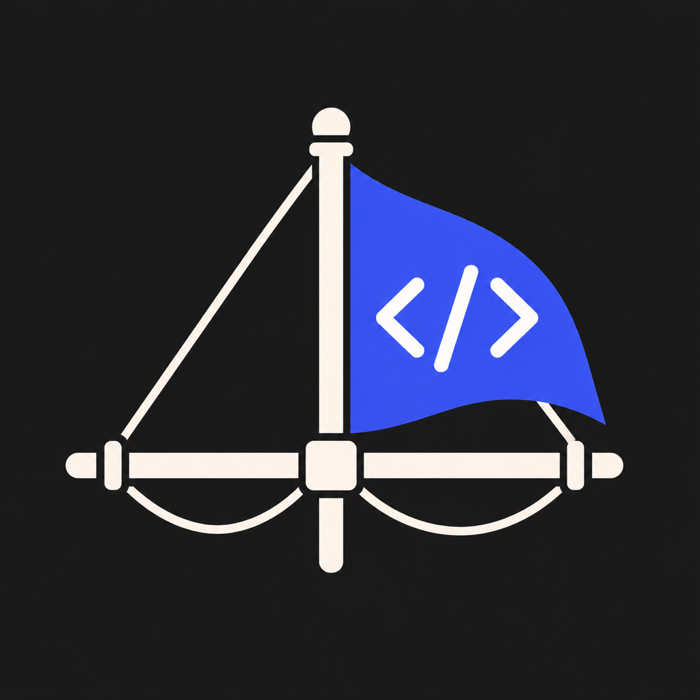

<p align="center">
  
</p>

<h1 align="center">Yardarm</h1>

<p align="center">
  A standalone desktop app for <a href="https://code.mastra.ai">Mastra Code</a>.
</p>

Yardarm is an Electron UI for the Mastra Code coding agent. The `mastracode`
runtime is bundled with the app — no separate install and no account required
to launch. It shares every config file with the `mastracode` CLI, so you can
move between the app and the terminal freely, and a global CLI install is one
click away (Settings → About).

> Yardarm is an independent project that builds on Mastra Code. It is not
> affiliated with, endorsed by, or sponsored by Mastra.

New here? The **[Getting Started guide](docs/getting-started.md)** walks
through installation, first-run setup, and every part of the app.

## Install

### Install script (macOS, Apple Silicon — recommended)

```sh
curl -fsSL https://raw.githubusercontent.com/JJJ-Mo3/yardarm/main/scripts/install.sh | sh
```

Downloads the latest release and installs it to `/Applications`. Use this
route if you can: release builds are unsigned, and macOS quarantines
browser downloads and refuses to open them ("Yardarm is damaged") — curl
downloads are not quarantined, so the script sidesteps that entirely. See
[Unsigned builds on macOS](#unsigned-builds-on-macos).

### Download a release manually (macOS, Apple Silicon)

**[Download the latest release](https://github.com/JJJ-Mo3/yardarm/releases/latest)** —
grab the `.dmg` (or the `.zip`) from the release's assets; all versions are
on the [Releases page](https://github.com/JJJ-Mo3/yardarm/releases).

Install the dmg (or drag `Yardarm.app` from the zip into `/Applications`),
then clear the quarantine flag before the first launch (see
[Unsigned builds on macOS](#unsigned-builds-on-macos)). Release builds can
update themselves from Settings → About.

### From source (all platforms)

Requirements: [Node](https://nodejs.org) 22+, [pnpm](https://pnpm.io) 10,
and git.

```sh
git clone https://github.com/JJJ-Mo3/yardarm.git
cd yardarm
pnpm install
pnpm dist        # installers into dist/ (dmg/zip, nsis, AppImage/deb)
# or
pnpm package     # unpacked app bundle, e.g. dist/mac-arm64/Yardarm.app
```

Targets: macOS (arm64). Windows/Linux electron-builder config exists but is
untested, and the bundled agent runtime is staged for the build machine's
platform — build on the platform you're targeting.

On macOS, drag `Yardarm.app` into `/Applications` (or install the dmg).

### Unsigned builds on macOS

Release builds are not code-signed or notarized, so macOS quarantines a
copy downloaded with a browser and Gatekeeper refuses to open it —
**"Yardarm is damaged and can't be opened. You should move it to the
Trash."** On macOS 15+ that dialog has no bypass, and the old
right-click → Open trick no longer works. Two ways around it:

- Use the [install script](#install-script-macos-apple-silicon--recommended)
  above — curl downloads are never quarantined.
- Or, after installing the dmg/zip manually, clear the quarantine flag once:

  ```sh
  xattr -dr com.apple.quarantine /Applications/Yardarm.app
  ```

  (If the dmg itself refuses to open, clear it there too:
  `xattr -d com.apple.quarantine ~/Downloads/Yardarm-*.dmg`.)

Apps you build yourself on the same machine are not quarantined and open
normally.

### Run in dev mode

```sh
pnpm install
pnpm dev
```

## Contents

- [Install](#install)
- [Why Mastra Code](#why-mastra-code)
- [What Yardarm adds](#what-yardarm-adds)
- [Features](#features)
- [First run](#first-run)
- [Using the app](#using-the-app)
- [Configuration paths](#configuration-paths-shared-with-the-mastracode-cli)
- [App data](#app-data)
- [FAQ](#faq)
- [Troubleshooting](#troubleshooting)
- [Development](#development)
- [Contributing](#contributing)
- [License](#license)

## Why Mastra Code

Yardarm exists because Mastra Code is a genuinely different coding agent:

- **Observational Memory** — instead of compacting the conversation when
  context runs out, a background observer continuously distills what matters
  and a reflector condenses it further. The agent keeps working with a small,
  dense memory of the session, so long-running work doesn't fall off a cliff
  at the context limit.
- **Goals with a judge** — hand the agent an objective (`/goal`) and it keeps
  running until an independent judge model agrees the goal is met, not just
  until the first "done" claim.
- **Bring any model** — OAuth in with existing Claude, OpenAI Codex, or
  GitHub Copilot subscriptions, use API keys from a dozen providers, or point
  it at any OpenAI-compatible endpoint (Ollama, LM Studio, vLLM, …).
  Different models per mode, per subagent, per judge, and per memory role.
- **Deeply extensible** — MCP servers, lifecycle hooks, skills and plugins,
  subagents, and custom slash commands (plain `.md` files), all configurable
  globally or per project.
- **Open source and local-first** — configuration is plain files on disk,
  shared between the CLI, ACP editors, and this app.

## What Yardarm adds

Yardarm puts a desktop workspace around the agent:

- **Parallel agents on one repo** — every chat gets its own git worktree on
  a `yardarm/…` branch, so several agents can build, test, and commit on the
  same project at once without touching your working copy or each other.
- **One-click rollback of code + conversation** — every user message pins a
  checkpoint (a real git ref). Roll back and both the transcript and the
  working tree return to that moment, with the agent told what happened.
- **Review and ship in one place** — side-by-side Monaco diffs of exactly
  what the agent changed, staging, commit, and push (with `gh` for GitHub
  PR flows or `glab` for GitLab MRs), plus a real terminal and a light IDE
  scoped to the chat's worktree. A **review** button in the chat header has
  the agent code-review the chat's changes or any open PR/MR, with
  one-click follow-ups to post the findings as comments or turn them into a
  plan.
- **Persistent, organized history** — projects and chats with full
  transcripts survive restarts in a local SQLite database.
- **Everything visible at a glance** — a color-coded mode selector, tool
  calls as expandable cards, plan-approval and tool-approval prompts as
  buttons, a goal popover with live progress and pause/resume, and
  Observational Memory activity/token budgets as status UI.
- **Configuration dialogs** — API keys, OAuth logins,
  per-mode/subagent/judge/memory models, custom providers, MCP servers,
  hooks, permissions, and per-project settings — all written back to the
  same files the CLI reads.
- **Local model conveniences** — Ollama auto-detect and auto-start,
  dropdowns filtered to models that will actually run, and no idle timeouts
  so a big local model can think for minutes without the run being cut off.
- **The CLI, embedded** — a CLI tab runs the interactive Mastra Code TUI
  inside the app, in the chat's worktree, seeing the same threads as the
  chat.
- **Setup included** — a first-run wizard that writes the same
  `settings.json` the CLI onboarding does, and a one-click global CLI
  install from Settings → About when you want the terminal too.

## Features

**Agent chat**

- Streaming agent chat with tool-call cards, plan approval, and tool-approval
  prompts (allow once / always / deny)
- Color-coded Plan / Build / Fast mode selector in the chat header — modes
  switch instantly, persist per chat, and are restored on relaunch — plus
  per-mode model selection, an extended-thinking toggle, and yolo mode
- Session permissions panel (`/permissions`): per-category and per-tool
  allow / ask / deny
- Full sandbox mode: run the agent's shell commands inside an OS-level
  sandbox (macOS seatbelt / Linux bubblewrap) — writes contained to the
  worktree and allowed paths, optional network block, a per-chat header
  toggle next to auto-approve (configure via the shield chip or `/sandbox`),
  and a global default for new chats
- Token compression: optionally shrink stale tool outputs before each model
  call to cut token costs (Settings → Preferences) — duplicates are stubbed,
  big JSON arrays crushed, noisy logs cleaned (progress bars, repeated
  lines, deep stack traces), unified diffs compacted without losing a
  single changed line, HTML stripped to text, long outputs excerpted, and
  the agent can fetch any compressed output back via a built-in
  `retrieve_full_output` tool; stored chat history is never modified and
  the savings show up in the cost popover (`/cost`) and as a green figure
  next to the usage counter in the chat header. An optional
  verbosity-steering switch nudges the agent toward terser replies
- Goals (`/goal`) with a live goal banner and a color-coded header chip
  (blue active, amber paused, green done) whose popover sets, pauses/resumes,
  or clears the goal and tunes the judge model and run limit — setting a
  goal can kick off a run toward it immediately, and past goals stay
  browsable in the popover's evaluation history with per-iteration
  pass/fail results and the judge's reasoning
- Agent code review from the **review** button in the header: review the
  chat's local changes against their base branch, or pick any open PR/MR
  from a `gh`/`glab`-powered list, optionally with a focus. Reviews run
  silently — the transcript shows a compact "Review: …" marker line instead
  of a user message — and finish with follow-up actions: post the findings
  as PR/MR comments, or switch to Plan mode and build a plan to execute
  them (`/review` does the same from the keyboard)
- Observational Memory status (`/om`) showing observer/reflector activity
  and token budgets
- Threads (`/threads`): switch, rename, clone, delete, open in a new subchat,
  with per-thread token usage in the cost popover (`/cost`)
- Multiple subchats per chat, each with its own agent process
- Fork from any message: a fork pill on your messages clones the agent's
  memory (a Mastra thread clone) into a new subchat tab, truncated to just
  before that point — explore an alternative direction while the original
  conversation continues unchanged
- Split view: a toggle in the tab bar opens a second chat pane side by
  side with a draggable divider — watch one agent run while prompting
  another
- Prompts sent while the agent is running are queued and delivered in order
  when the run finishes
- Image attachments (picker, paste, or drag-and-drop) and `@` file mentions
  in the composer
- Voice dictation via a composer mic button — cloud STT (OpenAI Whisper /
  GPT-4o Transcribe, Groq, Deepgram, …) using your own API key

**Slash commands**

- Autocomplete for the full command surface from code.mastra.ai — mode and
  model switches, threads, `/goal`, `/review`, `/subagents`, `/mcp`,
  `/hooks`, `/commands`, `/skills`, `/resource`, `/login`, `/api-keys`,
  `/diff`, `/help`, and more
- Project and global custom commands (`.md` files with frontmatter) are
  loaded through the mastracode command loader and run as prompts
- Commands that only make sense in a terminal (e.g. `/voice`) are listed in
  `/help` and point you to the CLI

**Local and custom models**

- Ollama is auto-detected (and can be auto-started); any OpenAI-compatible
  server can be added in Settings → Providers with a name, base URL, and
  model list — no API key required for local servers
- Model dropdowns only list models that are actually usable, and "default"
  entries show which model they resolve to
- No idle timeouts on model streams, so large local models that think
  silently for many minutes are not cut off mid-run

**Workspace**

- Projects sidebar with chats; each chat runs in an isolated git worktree by
  default (branch prefix `yardarm/`), with optional per-repo setup commands
  from `.yardarm/worktree.json`
- Changes view with side-by-side Monaco diffs, staging, commit, and push,
  plus a compare switcher to diff the worktree against any branch
  (merge-base based, read-only)
- Checkpoints: every user message pins a restorable snapshot
  (`refs/yardarm/checkpoints/*`); roll back the conversation and the tree
  together — plus a checkpoint manager in the Changes tab to create named
  checkpoints on demand, rename or tag them, compare any two as a diff, and
  prune stale automatic ones
- IDE tab: file tree + Monaco editor with multiple tabs and ⌘S saves (the
  agent is told about your edits immediately while it's working, or with
  your next message; clean buffers refresh when the agent changes files),
  a problems panel with language-server diagnostics for the active file
  (refreshed as you type, on open and on save, with inline markers; the
  TypeScript/JavaScript server is built in, HTML/CSS/JSON, YAML, Python and
  ERB servers are optional one-time downloads from Settings → Languages or
  the problems panel itself, and Go/Rust/Ruby use
  gopls/rust-analyzer/ruby-lsp from your PATH or well-known install dirs
  like ~/go/bin and ~/.cargo/bin), and an integrated
  terminal (node-pty + xterm) that opens in the chat's worktree
- CLI tab that runs the interactive Mastra Code TUI in the chat's worktree,
  sharing the chat's thread history
- Preview tab: an in-app browser for localhost dev servers — URLs are
  auto-detected from the chat's terminals, a one-click chip starts the
  project's dev server (with a static-site fallback) in a dedicated
  terminal, a wrench button docks full Chrome DevTools for the previewed
  page beside it, navigation is locked to localhost, and external links
  open in your system browser
- Kanban task board: author cards (title + prompt) in Backlog / To do,
  then drag one to In progress (or press play) to dispatch an agent —
  Yardarm creates the chat (worktree optional) and sends the prompt.
  Dispatched cards follow the agent's live status (needs input / in
  progress / ready to review) and can be marked done; sidebar chat rows
  show matching activity dots
- Analytics (chart icon in the tab bar): per-project token usage by day,
  model, and chat, token-compression savings, and CSV export — token
  counts only, no price guessing
- In-app guide & FAQ: the help button beside the theme toggle (or ⌘9)
  opens a built-in guide covering every part of the app
- Archive chats and projects to declutter the sidebar without deleting
  history or worktrees — archived items collapse into an "Archived" group
  and can be restored anytime; removing a project can optionally delete its
  folder on disk
- In-app updates from GitHub Releases (Settings → About), with optional
  automatic staging and a restart-to-finish banner on macOS

**Providers & auth**

- OAuth login for Anthropic (Claude subscriptions), OpenAI Codex, and GitHub
  Copilot in Settings → Providers — the browser flow runs inside the bundled
  runtime and credentials land in mastracode's `auth.json`
- Connectors (Settings → Connectors): one-click OAuth sign-ins for the
  GitHub, GitLab, Supabase, Netlify, Vercel, and Sentry MCP servers, with
  verified connection status — sign-ins are shared across all of a
  project's worktrees, so one login covers every chat
- API keys for any supported provider in Settings → API Keys, plus custom
  OpenAI-compatible providers in Settings → Providers
- Model defaults per mode, subagent, goal judge, and OM roles in
  Settings → Models — written to the shared `settings.json`
- Custom subagents editor (Settings → Agents, `/subagents`): create and
  edit the `.md` agent definitions (frontmatter
  `name`/`description`/`model`/`tools` + an instructions body) that the
  agent can delegate to via the `subagent` tool — global by default, or
  project-specific via the scope toggle and project picker — plus a
  Templates section listing 18 ready-made subagents (12 team roles such
  as developer, QA engineer, and security engineer, plus 6 domain
  specialists such as SaaS, mobile, and AI apps) added with one click
  and fully editable afterwards
- MCP servers editor (Settings → MCP Servers, `/mcp`): edit the `mcp.json`
  server lists — global by default, or project-specific via the scope
  toggle and project picker — with live server status (connected state and
  tool counts), one-click OAuth authentication for servers that need it,
  and reconnect for ones that dropped

**Per-project configuration**

- Project Settings dialog (gear in the sidebar): lifecycle hooks, custom
  commands, agent instructions, memory `resourceId`, and installed
  skills/plugins — plugins that declare a config schema get a generated
  settings form
- Edits are atomic, preserve unknown keys, and restart affected agent
  processes so they take effect immediately

## First run

On first launch a setup wizard mirrors the mastracode CLI onboarding:

1. **Welcome** — everything runs locally; no account is created.
2. **Connect a provider** — OAuth (Claude / Codex / Copilot), paste an API
   key, or skip and add a local model later.
3. **Mode pack** — pick the models used by Build / Plan / Fast modes (preset
   packs or per-mode custom choices).
4. **Observational Memory** — choose the memory/summarization model
   (optional).
5. **Yolo** — decide whether tool calls run without approval prompts.
6. **Summary** — nothing is written to disk until you finish (or skip).

The results land in mastracode's own `settings.json`, so the CLI is
configured too. You can re-run the wizard anytime from Settings → About →
"Run setup again".

Then add a project (any folder — it doesn't need to be a git repo yet), open
a chat, and type. Type `/` in the prompt to explore commands, or `/help` for
the full list.

### Using a local model (Ollama example)

1. Install [Ollama](https://ollama.com) and pull a model
   (`ollama pull qwen3.6:27b`).
2. Open Settings → Providers. Yardarm detects a running Ollama server
   automatically (and offers to start it if installed but not running).
3. Tick the models you want to expose (or add any OpenAI-compatible server
   by name + base URL + model ids).
4. Pick the model from the model selector in the chat composer.

No API key, no network egress — prompts go to `localhost` only.

## Using the app

This is the short version — the
[Getting Started guide](docs/getting-started.md) covers every screen and
workflow in detail, and the app has a built-in guide + FAQ (help button
beside the theme toggle, or ⌘9).

**Modes.** Plan mode explores and proposes before touching files; Build mode
edits; Fast mode is a lighter model for quick tasks. Switch with the
color-coded selector in the chat header (blue = plan, green = build,
amber = fast) or `/plan`, `/build`, `/fast`. Each chat keeps its own mode
across restarts, and each mode can have its own default model.

**Worktrees.** New chats get an isolated git worktree under the app's data
directory on a `yardarm/…` branch, so parallel chats can't trample your
checkout or each other. Repos without commits get a bootstrap "Initial
commit". If your project needs setup after a fresh worktree (installs,
codegen), put commands in `.yardarm/worktree.json`:

```json
{ "setup-worktree": ["pnpm install"] }
```

**Checkpoints.** Every user message pins a snapshot as a git ref. Use the
message menu to roll back — both the conversation and the working tree are
restored. The checkpoint manager in the Changes tab lists every checkpoint,
creates named ones on demand, renames/tags them, compares any two as a
diff, and prunes stale automatic ones.

**Changes.** The Changes tab shows worktree diffs with staging, commit, and
push (uses the `gh` CLI for GitHub PR flows, or the
[`glab` CLI](https://gitlab.com/gitlab-org/cli) for GitLab MRs — the host is
auto-detected from the origin remote, with a per-project override in
Project Settings for self-hosted instances). A compare switcher
diffs the worktree against any other branch (from their merge-base) for a
read-only look at how far the work has drifted.

**Review.** The **review** button in the chat header (next to the goal chip)
asks the agent for a thorough code review — of the chat's local changes
against their base branch, or of any open PR/MR picked from a
`gh`/`glab`-powered list, with an optional focus. The review runs without
posting a user message (the transcript shows a compact "Review: …" marker
line), and when it finishes a follow-up bar offers to post the findings as
comments on the PR/MR or to switch to Plan mode and turn them into an
implementation plan. `/review changes`, `/review <pr-number>`, and
`/review` (list open PRs/MRs) do the same from the keyboard.

**Goals.** Click the **goal** chip (or `/goal`) to give the agent an
objective; a judge model evaluates each run and the agent keeps going until
the goal is met. Setting a goal can start a run immediately, and the chip
stays color-coded with the goal's status (blue active, amber paused, green
done).

**Archiving.** Hover a chat row and click the archive icon to tuck finished
chats into an "Archived" section at the bottom of the sidebar — history and
worktrees are kept. Projects can be archived or removed (optionally
deleting the folder) from Project Settings → General.

**Terminal & IDE.** The Terminal tab is a real shell in the chat's
worktree; the IDE tab is a file tree + Monaco editor over the same
(multiple tabs, ⌘S to save — the agent hears about your edits immediately
while it's working, or with your next message, and clean buffers refresh
when the agent changes files), with a problems panel showing
language-server diagnostics for the active file. The CLI
tab runs the interactive Mastra Code TUI in the same worktree — it sees the
same threads as the chat (avoid running the chat and the CLI on the same
thread at once).

**Preview.** The Preview tab embeds a browser for localhost dev servers.
Server URLs printed in the Terminal or CLI tabs are detected automatically
and offered as chips (the first one loads by itself), and if nothing is
running a start chip launches the project's dev server (static sites get a
fallback server) in a dedicated terminal. Dev servers are per chat and
share ports, so starting one stops a server still running in another chat
(the chip tells you which). The wrench button docks full
Chrome DevTools for the previewed page beside it — elements, console, and
network. Navigation is locked to localhost; links to anywhere else open in
your system browser.

**Kanban & Analytics.** The Kanban tab is a task board that dispatches
agents: write cards (title + prompt) into Backlog / To do, drag one to In
progress to create a chat and set the agent working, and watch cards move
with the agent's live status. The chart icon in the tab bar opens
Analytics — token usage for the project by day, model, and chat, plus
compression savings and CSV export.

**Split view & forking.** The columns button in the tab bar opens a second
chat pane beside the current one (drag the divider to resize) — useful for
watching one agent run while prompting another. To branch a single
conversation instead, hover one of your messages and click the fork pill:
the agent's memory is cloned as a new Mastra thread into a new subchat tab,
truncated to just before that message, while the original continues
unchanged.

**Keyboard shortcuts** (Cmd on macOS, Ctrl elsewhere):

| Shortcut  | Action                                                                    |
| --------- | ------------------------------------------------------------------------- |
| `Cmd+N`   | New chat                                                                  |
| `Cmd+P`   | Thread switcher                                                           |
| `Cmd+1–9` | Switch tab (chat/CLI/IDE/changes/terminal/kanban/analytics/preview/guide) |
| `Cmd+J`   | Toggle terminal tab                                                       |
| `Cmd+,`   | Settings                                                                  |

## Configuration paths (shared with the mastracode CLI)

Global:

- `~/.mastracode/settings.json` — model defaults per mode, subagent models,
  goal judge, Observational Memory defaults, custom providers, preferences
- `~/.mastracode/mcp.json` — global MCP servers
- `~/.mastracode/hooks.json` — global lifecycle hooks
- `~/.mastracode/commands/**/*.md` — global custom slash commands
- `~/.mastracode/database.json` — global memory `resourceId`
- App-data dir (`~/Library/Application Support/mastracode` on macOS,
  `%APPDATA%\mastracode` on Windows, `$XDG_DATA_HOME/mastracode` on Linux):
  `auth.json` (API keys + OAuth credentials), agent database

Per project (Project Settings gear in the sidebar):

- `.mastracode/mcp.json` — project MCP servers
- `.mastracode/hooks.json` — project hooks (appended after global)
- `.mastracode/commands/**/*.md` — project slash commands
- `.mastracode/agent-instructions.md` — project agent instructions
- `.mastracode/database.json` — project memory `resourceId`

Edits made in the app are written atomically and preserve unknown keys, so the
same files stay usable from the CLI. Config edits restart the affected agent
processes so changes take effect.

## App data

The app's own state (projects, chats, transcripts, checkpoints) lives in a
SQLite database (`yardarm.db`) in Electron's userData directory — separate
from mastracode's files:

- macOS: `~/Library/Application Support/yardarm/`
- Windows: `%APPDATA%\yardarm\`
- Linux: `~/.config/yardarm/`

Chat worktrees live under `worktrees/<projectId>/<chatId>` in the same
directory. The database runs in WAL mode with periodic maintenance
(vacuum/optimize, size-bounded transcripts) so long-lived installs don't
degrade.

## FAQ

**Do I need an account?**
No. There is no signup, login, or telemetry in Yardarm itself. You only
authenticate with the model providers you choose to use.

**What data leaves my machine?**
Prompts and code context go to whichever model endpoints you configure —
and nowhere else. With a local provider (Ollama, LM Studio, …) inference
traffic stays on `localhost`. Mastra Code's cloud gateway is only contacted
if you use models served through it. Voice dictation sends audio to the STT
provider you selected, only while you record. The only network traffic from
Yardarm itself is the update check against this repo's GitHub Releases —
Settings → About lets you turn automatic checks off.

**Can I use the CLI and the app at the same time?**
Yes — that's the point. They share `settings.json`, `auth.json`, MCP/hooks
configs, and custom commands. The app writes those files atomically and
preserves keys it doesn't know about.

**Where are my API keys stored?**
In mastracode's own `auth.json` in its platform app-data directory (see
above). Yardarm reads and writes the same file the CLI uses; keys are never
sent anywhere except to the provider they belong to.

**Can I run fully offline / air-gapped?**
Yes, with local models: complete onboarding by adding a local provider, and
skip OAuth/API keys entirely.

**My local model is slow — will runs time out?**
No. Yardarm disables HTTP idle timeouts for agent traffic specifically so
big local models can sit silent through long prompt-processing phases. You
can always stop a run manually.

**What context window do I need for a local model?**
64k tokens minimum; 128k or more if your machine has the memory. The
agent's base prompt (system prompt, tool definitions, project context) is
roughly 30k tokens before you type anything, and the conversation only
grows from there — there is no client-side compaction for local providers,
so even a 64k window can fill up within a single working session. Some
servers (Ollama) also silently truncate the prompt to fit, which degrades
the agent well before it fails outright. Ollama defaults to ~4k: raise it
in the Ollama app (Settings → Context length) or start the server with
`OLLAMA_CONTEXT_LENGTH=65536 ollama serve`. In LM Studio, set the context
length when loading the model; for llama.cpp, pass `-c 65536`. Starting a
new chat resets the conversation and frees context.

**Why does a chat get its own branch/worktree?**
Isolation: the agent can edit, build, and commit without touching your
checked-out branch, and parallel chats can't conflict. You can merge or PR
the `yardarm/…` branch from the Changes tab, or create chats without a
worktree.

**How do I uninstall completely?**
Delete the app, then remove the app data (`…/yardarm`, paths above). If you
also want to drop Mastra Code's shared config, remove `~/.mastracode` and
the `mastracode` app-data directory — but note the CLI uses those too.

**Is this an official Mastra product?**
No. Yardarm is an independent open-source project. "Mastra" and "Mastra
Code" are trademarks of their respective owner; they're used here only to
describe compatibility.

**Why "Yardarm"?**
Mastra ships the mast; this is the spar that hangs off it.

## Troubleshooting

**"Yardarm is damaged and can't be opened" (macOS).**
The build is unsigned and the downloaded copy is quarantined. Run
`xattr -dr com.apple.quarantine /Applications/Yardarm.app` once, or install
via the script — see [Unsigned builds on macOS](#unsigned-builds-on-macos).

**The agent won't start / chat shows a runtime error.**
Open Settings → About: it shows the bundled runtime's boot status, versions,
and the full error if mastracode failed to load. "Run setup again" re-runs
onboarding if config is the culprit.

**No models appear in the dropdown.**
The dropdown lists only usable models — add an API key (Settings →
API Keys), log in with a provider subscription (Settings → Providers), or
add a local model (Settings → Providers). For Ollama, make sure the server
is running (`ollama serve`) and at least one model is pulled.

**"The model stopped because it reached its maximum output length before finishing."**
The conversation filled the local server's context window. Raise it to 64k
minimum, 128k+ if you can — see
[What context window do I need for a local model?](#faq) — and start a new
chat to reset the conversation. Even a large window fills up eventually in
long sessions.

**A run ended with a network-ish error mid-task.**
Check the local model server's own logs (e.g. `ollama serve` output) — the
app does not impose idle timeouts, so a dropped stream usually means the
server restarted or unloaded the model.

**Worktree creation fails.**
The project must be a git repository Yardarm can write to. Repos with no
commits are handled (a bootstrap commit is created); bare repos and repos
with exotic `core.worktree` settings are not supported.

**Something else?**
Please [open an issue](https://github.com/JJJ-Mo3/yardarm/issues) with the
error text from Settings → About or the chat.

## Development

```sh
pnpm dev             # run in development
pnpm typecheck       # tsc for main/preload/shared + renderer
pnpm lint            # eslint
pnpm format:check    # prettier
pnpm test            # vitest
pnpm check:commands  # slash-command registry covers code.mastra.ai
pnpm build           # production build to out/
pnpm package         # unpacked app bundle (dist/, no installers)
pnpm dist            # installers (electron-builder)
```

### Architecture

- **Shell**: Electron + electron-vite, React 19, Tailwind 4, jotai, tRPC over
  IPC (superjson), Monaco, xterm
- **Agent host**: each active subchat forks a `utilityProcess` that imports
  the bundled `mastracode` SDK (`createMastraCode`) and speaks a small JSON
  message protocol with the main process (streaming events, requests with
  timeouts, OAuth flows). `src/main/agent-host/agent-host.ts` and
  `src/shared/ipc-types.ts` are the SDK boundary.
- **Persistence**: better-sqlite3 + drizzle in the main process
- **Isolation**: chats run in dedicated git worktrees; checkpoints are pinned
  as git refs so they survive GC until deleted
- **Packaging**: electron-builder; native modules are kept outside the asar
  (`asarUnpack`), and the mastracode runtime ships as a self-contained,
  npm-staged tree in `Resources/agent-runtime` (see
  `scripts/build-agent-runtime.mjs`) that the agent host imports when packaged

See [AGENTS.md](AGENTS.md) for the full layout, conventions, and gotchas.

## Contributing

Issues and PRs are welcome.

- Before sending a PR, make sure `pnpm typecheck`, `pnpm lint`,
  `pnpm format:check`, `pnpm test`, and `pnpm check:commands` all pass.
- Style is Prettier-enforced; exported functions have explicit return types.
- Commit subjects are short and imperative, with no type prefixes or
  generated-by trailers.
- For packaging-affecting changes, boot-check the packaged app
  (`pnpm package`, launch it, confirm it stays alive with an empty error
  log) before committing.

## License

[Apache-2.0](LICENSE). Yardarm bundles the Mastra Code runtime
(`mastracode`, `@mastra/code-sdk`, `@mastra/core`), which is © Kepler
Software, Inc. and licensed under Apache-2.0.
